##    📊 Data Job Market Analysis (2020–2024)

> **Project Status: Completed**


##    📊 Project Overview:

This project presents a comprehensive Exploratory Data Analysis (EDA) of the global data job market from 2020 to 2024. 

The analysis explores how job demand, salaries, work models, company size, employment types, and experience levels have evolved across multiple data domains such as:

- Data Science
- Data Engineering
- Data Analysis
- Machine Learning & AI
- Business Intelligence
- Data Architecture
- Leadership & Management

---


##    📊 View Project:

**🔹 Option 1:** Explore Interactive Streamlit Dashboard (Recommended)
-  Live Dashboard: [data-job-market-analysis-live-dashboard](https://data-job-market-analysis-dashboard.streamlit.app/)

- Experience the complete analysis through an interactive web application with:
    - Dynamic filters and controls
    - Interactive visualizations
    - Domain-wise analysis
    - Salary and trend exploration
    - Data-driven insights and conclusions


- **Live Dashboard Preview**

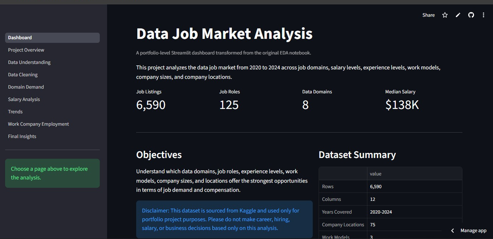

---

**🔹 Option 2:** Browse the Jupyter Notebook
-  Jupyter Notebook: [data-job-market-analysis-jupyter-notebook](https://github.com/Chauhanekta21/Data_Job_Market_Analysis/blob/master/Jupyter%20Notebook/main_file.ipynb)

- Includes:
    - Complete source code
    - Data cleaning and analysis workflow
    - EDA & Visualization
    - Key Insights
 

- **Jupyter Notebook Preview**

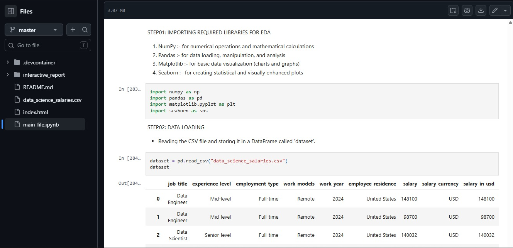

-  Note: GitHub may occasionally fail to render large notebooks. If the notebook preview does not load, use the options below:

---

**🔹 Option 3:** View EDA Notebook via GitHub Pages
-  Notebook Viewer: [data-job-market-analysis-github-pages](https://chauhanekta21.github.io/Data_Job_Market_Analysis)


- **EDA Notebook via GitHub Pages Preview**

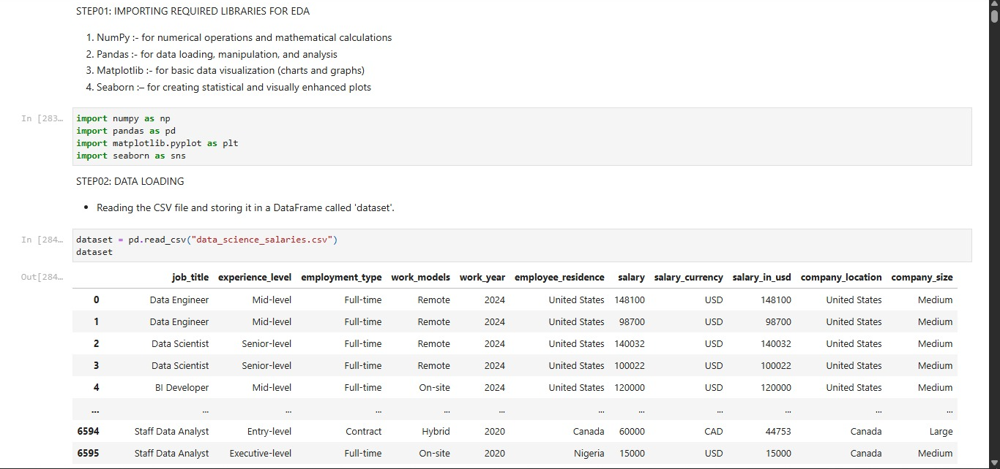

---

**🔹 Option 4:** Download and View Locally
-  Download main_file.ipynb or index.html and open them locally for the complete offline EDA experience.

---


##    📊 Objectives:
- Analyze job demand across different data domains
- Understand salary distribution and trends
- Compare salaries across experience levels and roles
- Study impact of work models (Remote / On-site / Hybrid)
- Identify top-paying job roles and countries
- Analyze hiring patterns based on company size
- Study employment type distribution
- Track changes in demand and salary from 2020–2024

  ---


##    📊 Dataset Information:
- Source: Kaggle
- Link: https://www.kaggle.com/datasets/sazidthe1/data-science-salaries
- Time Period: 2020–2024
- File Used: data_science_salaries.csv
- Key Features:
    - job_title
    - job_category (engineered feature)
    - experience_level
    - salary_in_usd
    - work_year
    - work_models
    - company_location
    - company_size
    - employment_type

---


##    📊 Tools & Libraries Used:
- Python
- NumPy: numerical operations
- Pandas: data manipulation
- Matplotlib: data visualization
- Seaborn: statistical plotting

---


##    📊 Data Cleaning & Feature Engineering:
- Created a copy of the original dataset to preserve raw data
- Standardized inconsistent job titles
- Engineered a new feature: job_category to group similar roles
- Handled missing values and duplicate records
- Detected and treated outliers in salary using group-wise IQR method
- Removed extreme unrealistic salary values (>600K USD)

---

##    📊 Exploratory Data Analysis (EDA):

### 🔹 1. Job Demand Across Data Domains
-  Data Science dominates job listings
-  Data Engineering and Data Analysis follow closely
-  AI/ML shows strong emerging demand

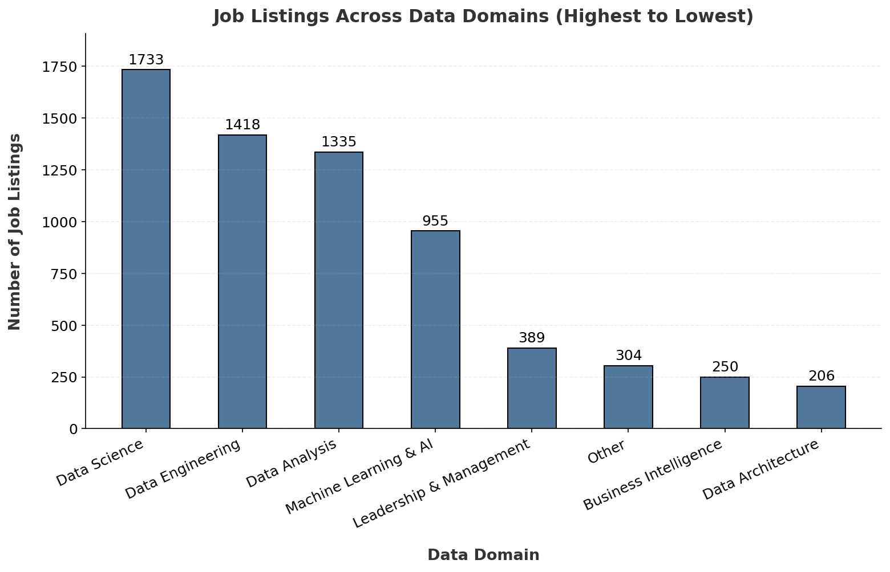

---
  
### 🔹 2. Top Roles per Domain
- Each domain is dominated by one key role
- Example:
  - Data Science → Data Scientist
  - Data Engineering → Data Engineer
  - Analyst → Data Analyst

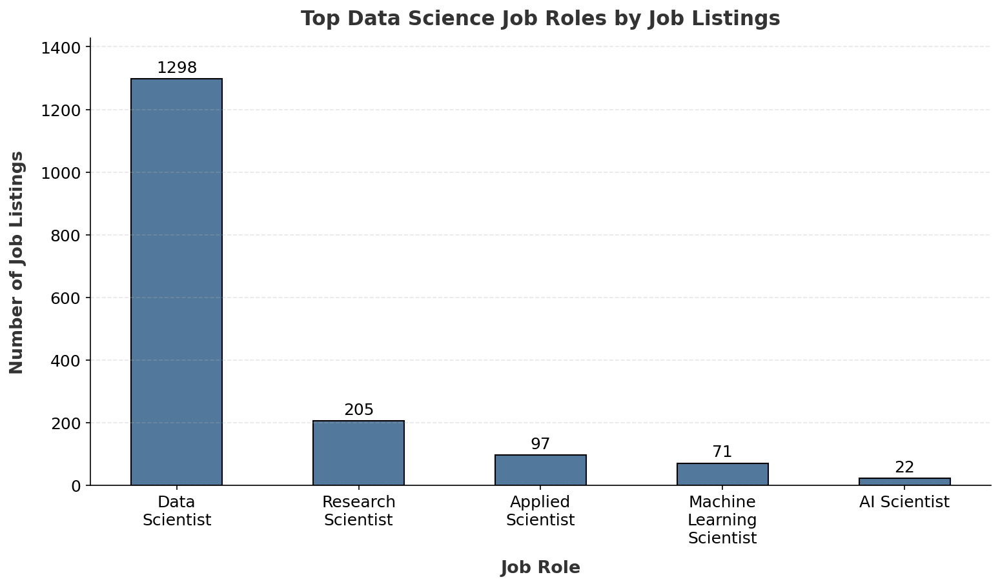

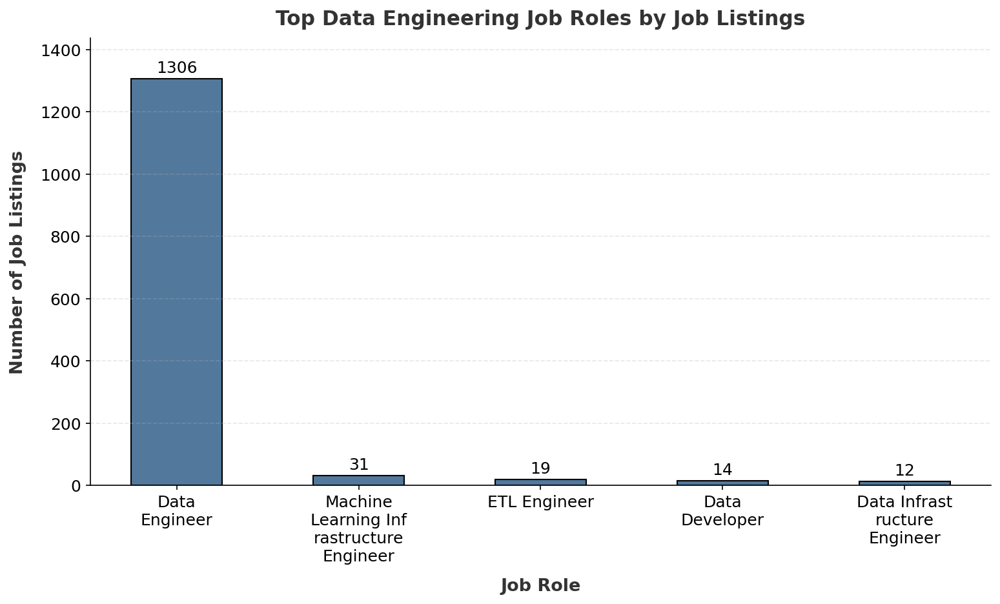

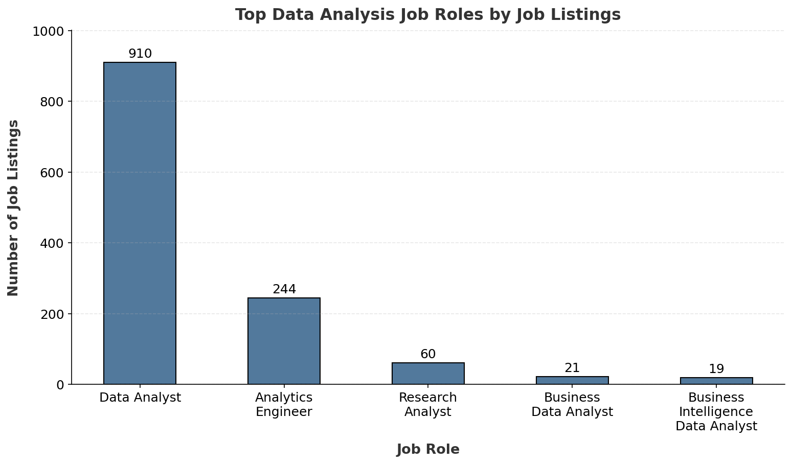


---
  
### 🔹 3. Salary Comparison Across Domains
-  Highest salaries: Machine Learning & AI
-  Strong salaries: Leadership & Data Architecture
-  Lower salaries: Data Analysis & BI

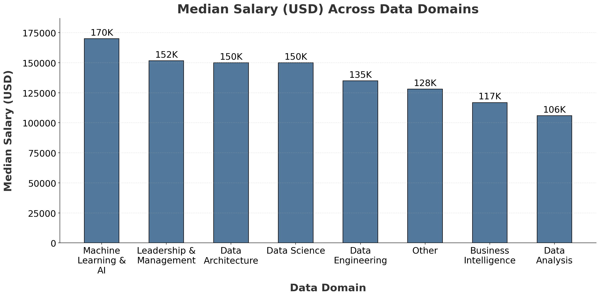

---

### 🔹 4. Top Paying Job Roles
-  Highest salaries found in Directors, Managers, Architects (AI / Cloud / Data)

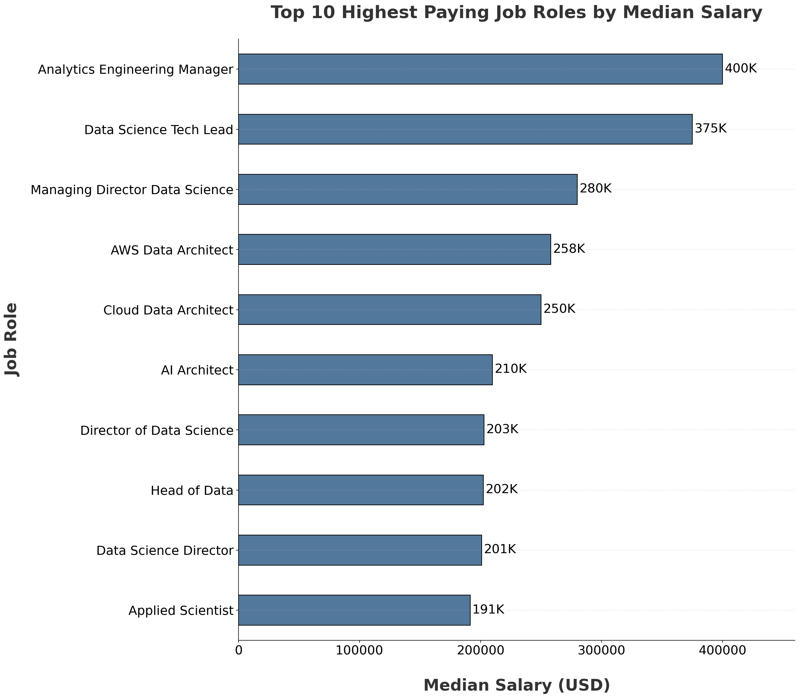

---

### 🔹 5. Demand vs Salary Relationship
-  High demand ≠ High salary
-  AI/ML: High salary + moderate demand (premium niche)
-  Data Analysis: High demand + low salary

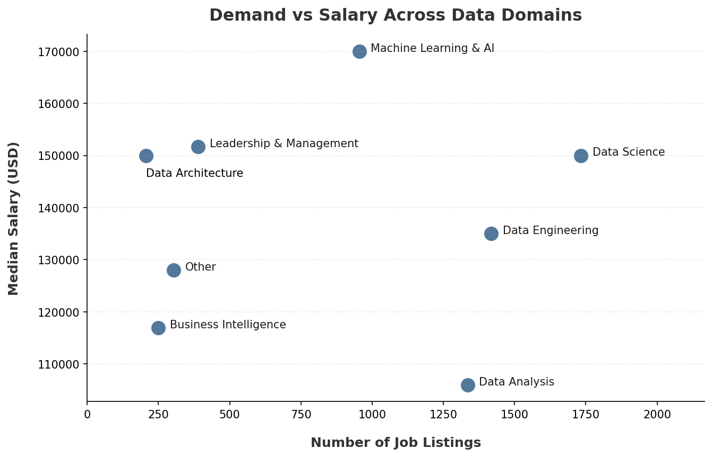

---

### 🔹 6. Demand Trend (2020–2024)
-  Strong growth from 2020–2023
-  Peak demand in 2023
-  Slight drop in 2024 (possible incomplete data)
-  AI/ML shows fastest growth after 2022

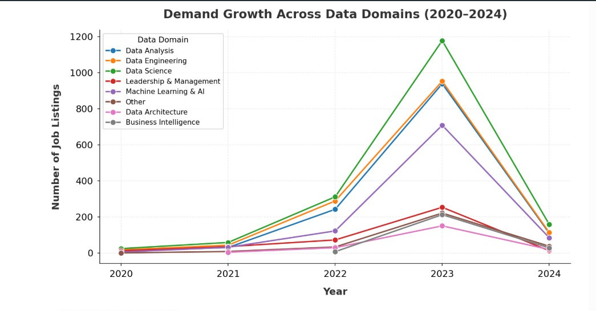

---

### 🔹 7. Salary Trend (2020–2024)
-  AI/ML shows highest salary growth
-  Data Engineering shows steady rise
-  BI and Data Analysis show slow growth

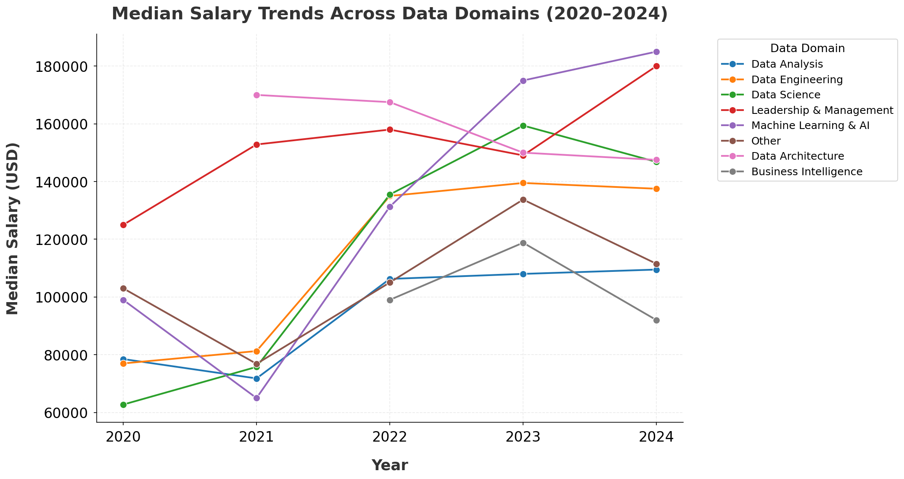

---

### 🔹 8. Experience Level Insights
-  Senior roles dominate job demand
-  Executive roles are fewer but highest paying
-  Entry-level opportunities are limited

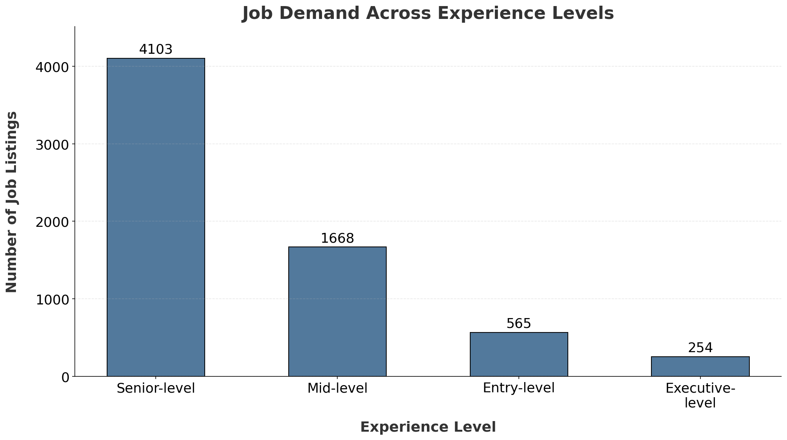

---

### 🔹 9. Salary by Experience Level
-  Executive → highest salary
-  Senior → strong earning potential
-  Entry-level → lowest salary

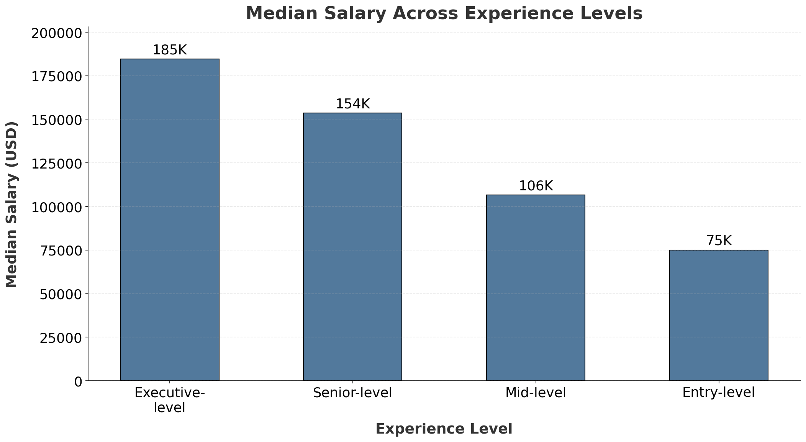

---

### 🔹 10. Work Model Distribution
- On-site roles dominate the market at 57.75%
- Remote roles account for 38.83%
- Hybrid roles have the lowest share at 3.41%

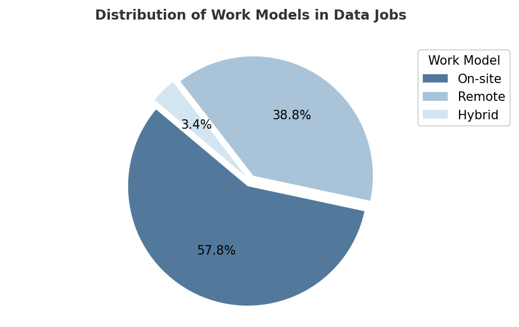

---

### 🔹 11. Work Model Preferences
-  On-site dominates all domains
-  Remote is second most common
-  Hybrid adoption is minimal

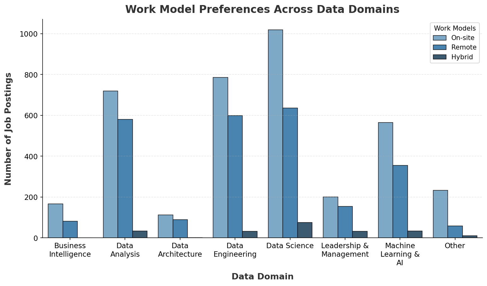

---

### 🔹 12. Salary by Work Model
-  On-site = highest salary
-  Remote = nearly equal pay
-  Hybrid = lowest salary

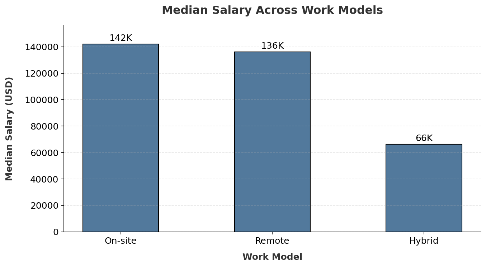

---

### 🔹 13. Company Locations
-  Highest-paying regions include: Qatar, United States, Canada, Saudi Arabia
-  High salaries are globally distributed

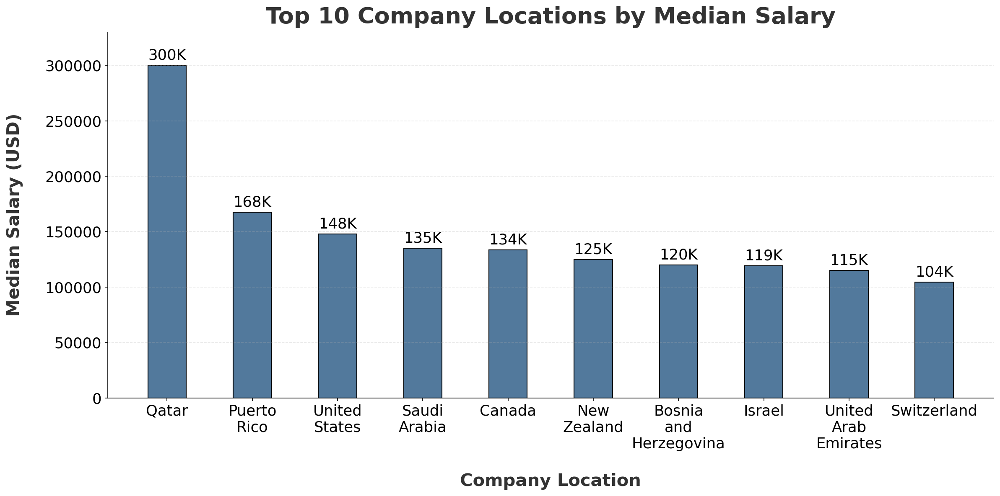

---

### 🔹 14. Company Size Hiring Patterns
-  Medium companies hire the most
-  Large companies follow
-  Small companies have lowest hiring

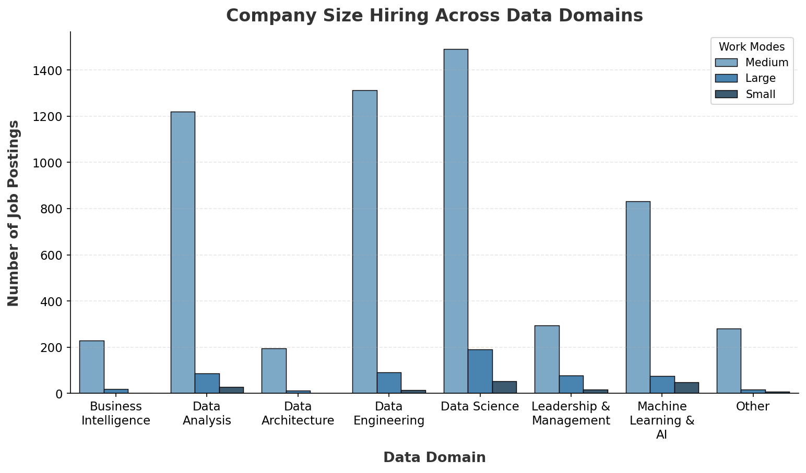

---

### 🔹 15. Salary by Company Size
-  Medium companies → highest median salary
-  Large companies → second highest
-  Small companies → lowest

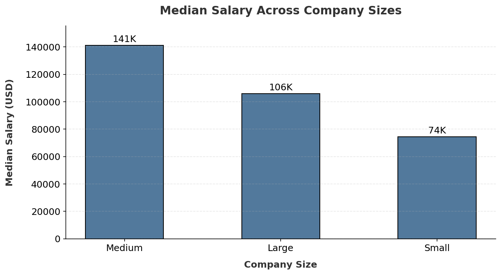

---

### 🔹 16. Employment Type Distribution
-  Full-time dominates the market
-  Contract and part-time roles are rare
-  Industry strongly prefers stable employment

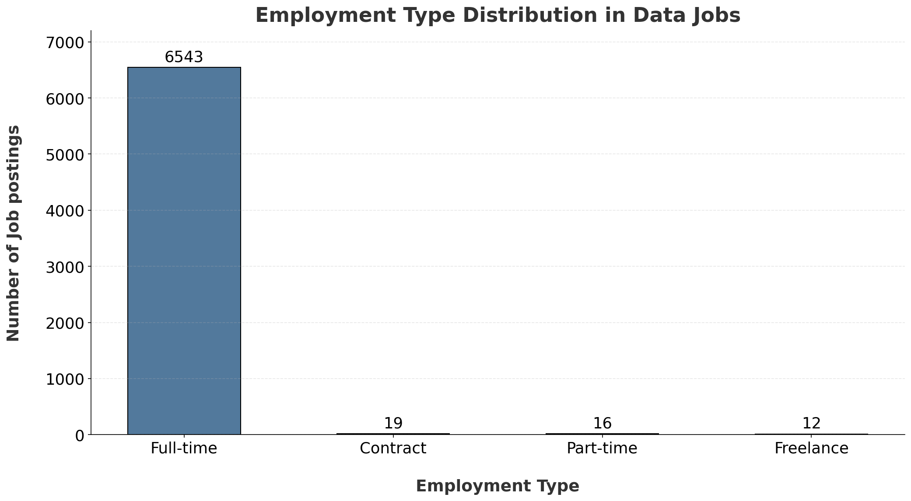

---

##    📊 Key Overall Insights:
- AI/ML is the fastest-growing and highest-paying domain
- Data Engineering is the most stable career path
- Data Analysis & BI are high demand but lower salary domains
- Experience level strongly impacts salary growth
- On-site jobs still dominate but remote remains strong
- Medium-sized companies offer the best balance of salary and hiring
- Market demand peaked in 2023 with slight slowdown in 2024

---

##    📊 Conclusion:
- The data job market (2020–2024) shows a clear shift toward:
  - AI-driven roles
  - Specialized skill-based hiring
  - Experience-based salary growth
  - Hybrid work still under development
- Overall, specialization + experience = highest value in the modern data job market.

---

##    📊 Repository Structure:

```text
Data_Job_Market_Analysis/
├── Data/
│   ├── data_science_salaries.csv
│   └── data_science_salaries_clean.csv
│
├── Images/
│   └── 22 Visualization and dashboard PNG images
│
├── Jupyter Notebook/
│   └── main_file.ipynb
│
├── Streamlit Dashboard/
│   ├── .gitignore
│   ├── Dashboard.py
│   ├── pages/
│   │   ├── 1_Project_Overview.py
│   │   ├── 2_Data_Understanding.py
│   │   ├── 3_Data_Cleaning.py
│   │   ├── 4_Domain_Demand.py
│   │   ├── 5_Salary_Analysis.py
│   │   ├── 6_Trends.py
│   │   ├── 7_Work_Company_Employment.py
│   │   └── 8_Final_Insights.py
│   └── utils/
│       ├── charts.py
│       ├── data_loader.py
│       └── formatting.py
│
├── index.html
├── README.md
└── requirements.txt
```

---

##    📊 Skills Demonstrated:
- Exploratory Data Analysis (EDA) on real-world job market data
- Data Cleaning and Preprocessing (handling missing values, duplicates, and outliers)
- Feature Engineering (creating job_category for better analysis)
- Data Visualization using Matplotlib and Seaborn
- Statistical Analysis (median, distribution, trend analysis)
- Business Insight Generation from raw datasets
- Python (Pandas, NumPy) for data manipulation and analysis
- Salary and Demand Trend Analysis across multiple dimensions (domain, experience, location, company size)
- Analytical Thinking for identifying patterns in real-world data job market (2020–2024)

---

##    📊 Future Improvements:
- Apply predictive modeling to forecast future salaries and job demand trends across different data domains based on historical data (2020–2024)


---


##     Disclaimer: 

- This project is for educational and portfolio purposes only. Insights are based solely on the publicly available ai-jobs.net Salaries     dataset and should not be interpreted as industry-wide conclusions.

---
